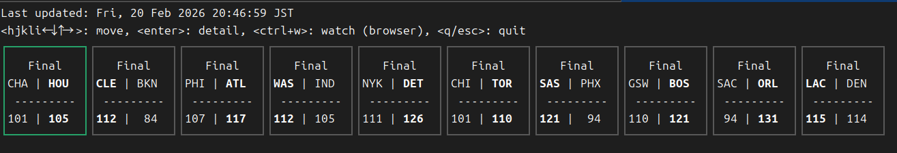
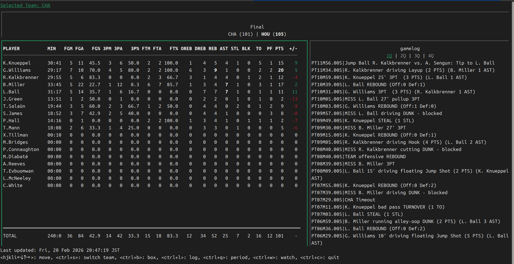

# nba-tui

## NBA Client for Programmer

- 💄 Terminal UI for NBA Score
- 👾 90% VibeCoding
- ✨ Vim-Like KeyBinding
- 🤩 Awesome Example of [go-nba-sdk](https://github.com/poteto0/go-nba-sdk)

## Quick Start

```bash
$ just build
$ ./nba-tui
```

## Options

| Option      | Description                                       | Default | Minimum |
|-------------|---------------------------------------------------|---------|---------|
| `--reload`  | Auto-refresh interval for game data in seconds.   | 30      | 10      |



